# T03: GESTIÓ FLEXIBLE DE DISCOS (WINDOWS)

**Autor:** David Ballesteros Antich  
**Curs:** 2B – CFGM Sistemes Microinformàtics i Xarxes  
**Mòdul:** Seguretat informàtica  
**Professora:** Isabel Bosch  
**Data:** 02/10/2025  
**Guia de comandes:** [Document original]([https://docs.google.com/document/d/1R-FFYnsRPVyzYx2FpculMyQtKFhqpgO-tayO0LNToKQ/edit?usp=sharing](https://docs.google.com/presentation/d/1EFSMfLQRM0wvxRFEvXLN0oaiBq3goWNQ/edit?usp=sharing&ouid=104728425662496836733&rtpof=true&sd=true))

## Configuració inicial

Primer afegirem els **3 discos virtuals** a la màquina virtual.

Un cop creats els discos, **iniciem la màquina**. Quan Windows s'hagi iniciat, hem d'anar al **Panell de control** i buscar la secció **Espais d'emmagatzematge**.

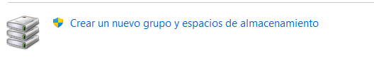

Allà seleccionarem **Crear un nou grup i espais d'emmagatzematge**.

Windows ens mostrarà els discos disponibles. En aquest primer pas **només seleccionarem 2 discos** i acceptarem.

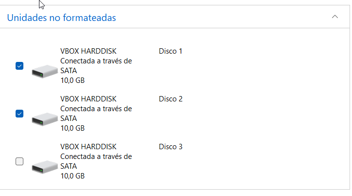

Això crea el **Storage Pool**, que és el contenidor on es poden crear volums amb diferents nivells de resiliència.

## Configuracions (Mirror)

Un cop creat el Storage Pool ens sortirà una secció tal i així:

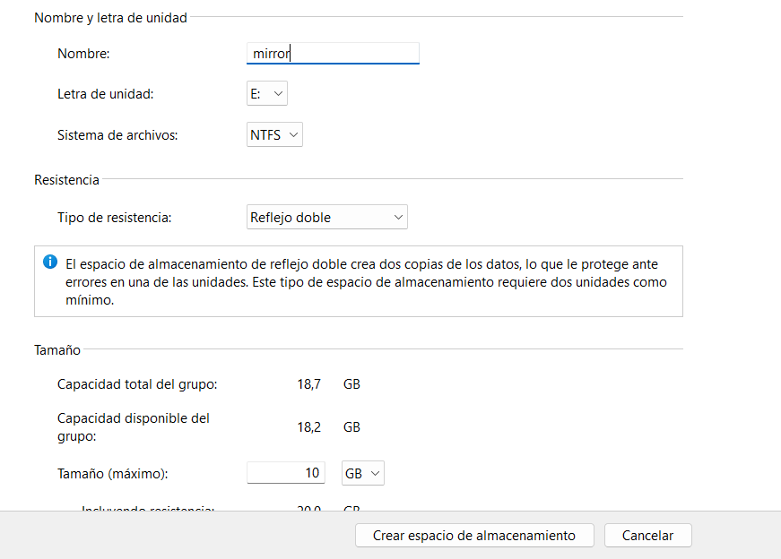

Un cop creat el Storage Pool, ens apareixerà una secció com aquesta: ara configurarem el disc. En el meu cas he escollit:

- **Sistema d'arxius :** NTFS
- **Tipus de resiliència :** Reflex doble (Mirror)
- **Mida :** màxima disponible

Hem de recordar que, encara que hem posat **dos discos de 10 GB cadascun**, el reflex doble fa una clonació en temps real, així que la capacitat útil serà només **10 GB** (la resta es fa servir per la còpia).

Per provar la resiliència, crearem un arxiu anomenat **prueba** dins la nova unitat.

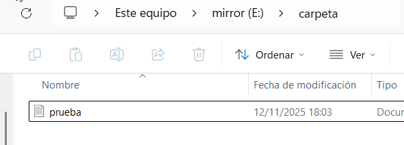

Ara apagarem l'ordinador i **eliminarem un dels dos discos** de la màquina virtual per simular un error.

En tornar a iniciar Windows, apareixerà una **advertència indicant que el disc s'ha reduït**.

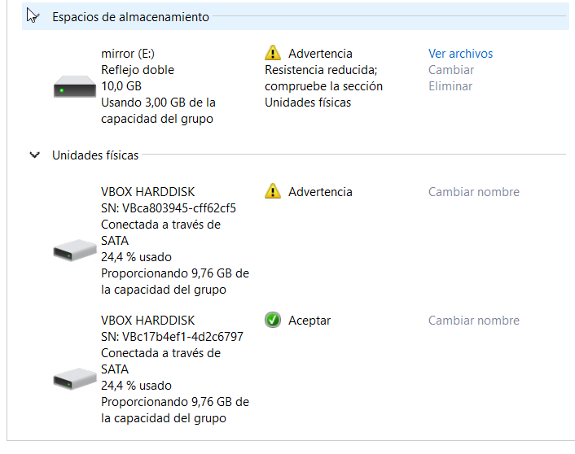

Tot i així, encara podrem obrir l'arxiu sense cap problema.

Això demostra que el *mirror* realment protegeix contra la fallada d'un disc.

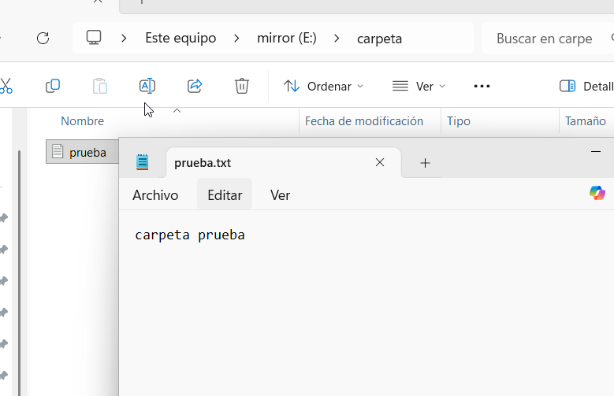

## -

Abans de continuar, cal entendre què és la **paritat**:

> La paritat és un mètode de protecció de dades que permet recuperar la informació encara que un dels discos falli, **sense haver de duplicar tota la informació** com passa amb el mirall.

Ara tornarem a activar el disc que havíem tret, iniciarem la màquina i repetirem els passos inicials, però aquesta vegada **seleccionant 3 discos**.

Provarem la resiliència de tipus **Paritat**.

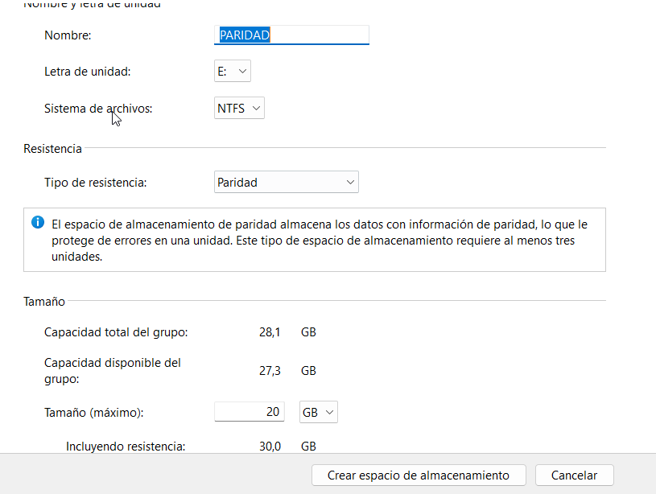

La paritat només utilitza l'espai d'un disc per guardar la informació de protecció.

Això vol dir que, si utilitzem **3 discos de 10 GB**, obtindrem aproximadament **20 GB útils**, ja que 10 GB es destinen a la informació de paritat.

Aquesta configuració és més eficient en espai que el mirall.

## Configuració (Triple Mirror)

Ara, amb la màquina apagada, hem d'afegir **2 discos més** per provar la següent resiliència.

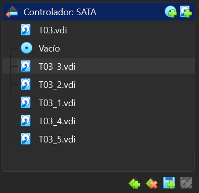

Iniciarem la màquina i repetirem la configuració inicial una altra vegada.

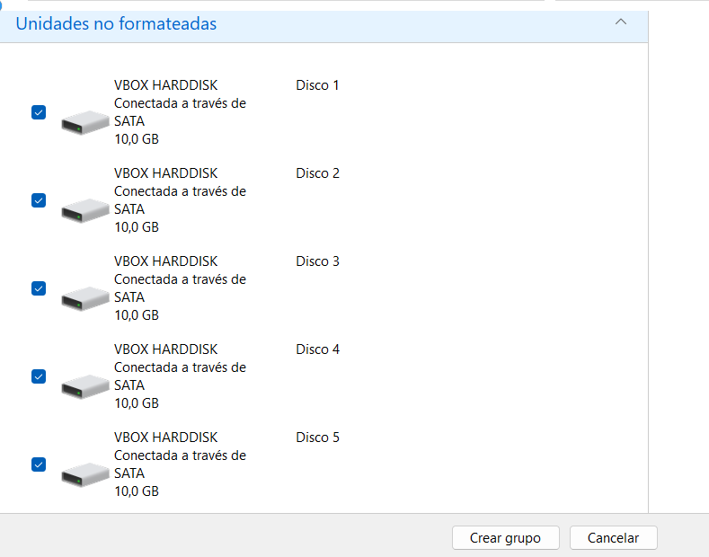

Ara Windows detectarà els **dos discos nous** i els podrem seleccionar tots.

Un cop seleccionats tots els discos, crearem un **nou grup d'emmagatzematge** i tornarem a configurar-lo.

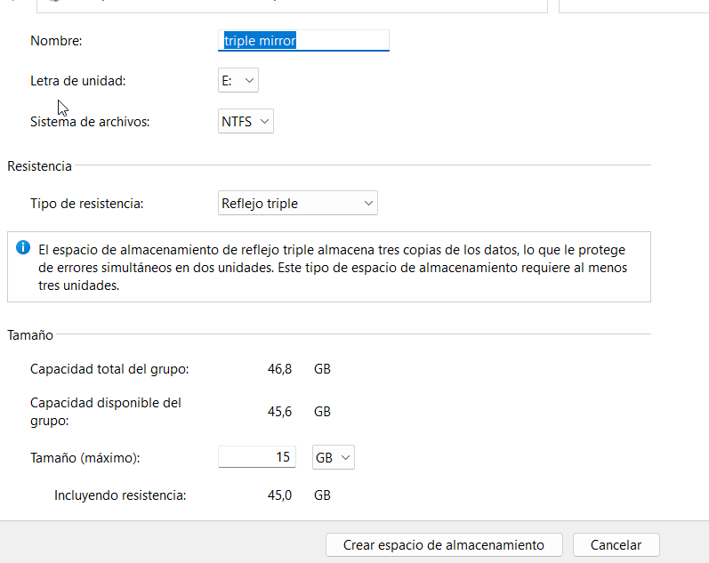

Amb 3 discos ja es podria fer una configuració de resiliència, però per al **Triple Mirror** (reflex triple) es recomana tenir **un mínim de 5 discos** per disposar d'un espai d'emmagatzematge útil i estable.

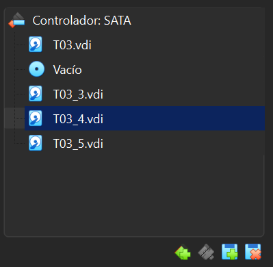

Per comprovar-ho, podem treure 2 discos i tornar a iniciar la màquina.

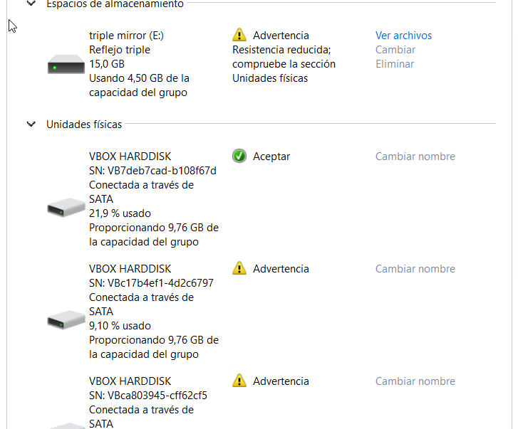

Apareixerà un avís indicant que hi ha hagut una reducció, però el «disc» virtual continuarà funcionant correctament.

[Tornar a enunciat](readme.md)
