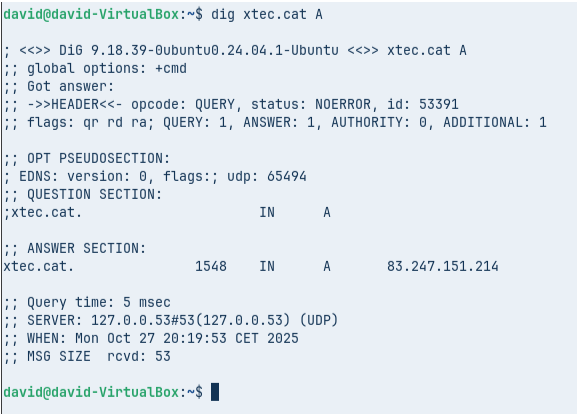
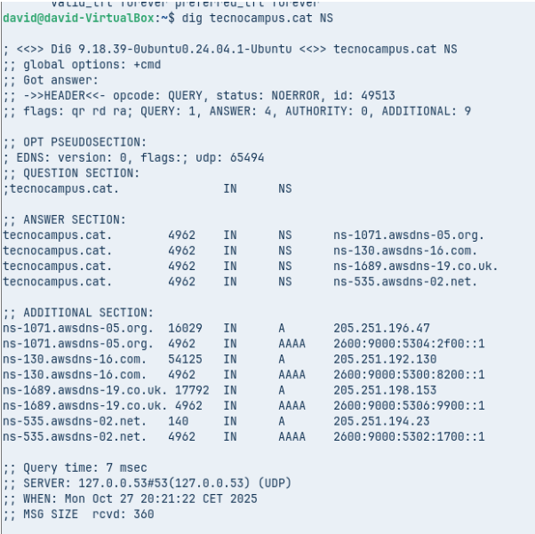
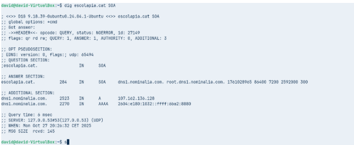
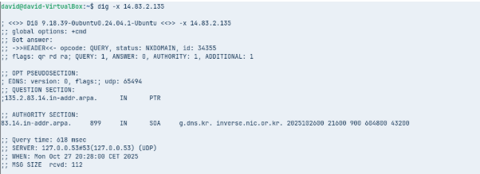
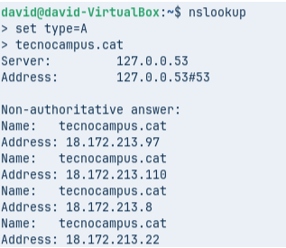
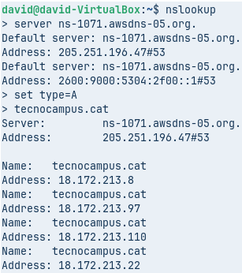
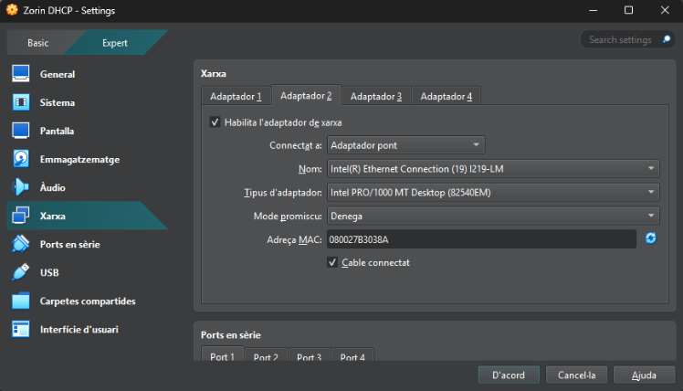
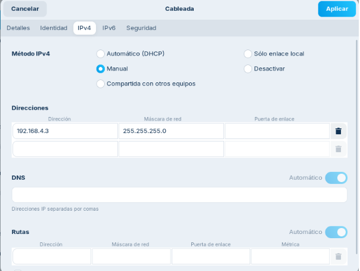
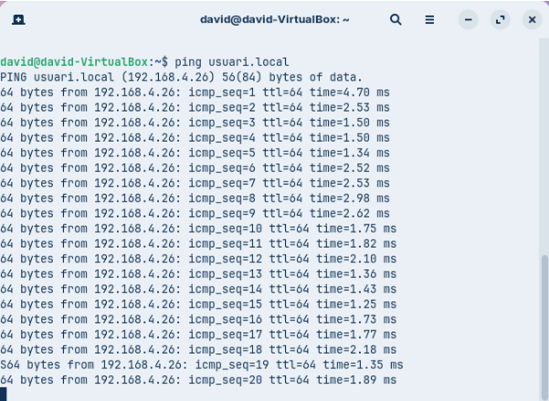

# Fase Pràctica: Diagnosi de Noms (Auditoria amb CLI)

Per començar caldrà utilitzar un equip **Zorin** amb dues interfícies:
- **Primera:** en NAT  
- **Segona:** en adaptador pont amb la IP correctament configurada segons indicacions dels vostres responsables.

---

## Diagnosi Avançada amb `dig` (Linux / macOS)

### Comanda 1: Consulta Bàsica de Registre A

- **Executa dig xtec.cat A**

- **Anàlisi: Identifica la IP de resposta, el valor TTL i el servidor que ha respost a la consulta.**

  Observant la imatge, podem veure que la IP de resposta és **83.247.151.214** amb **valor TTL** de **3558 segons**. Sent el servidor que ha respost a la consulta el **127.0.0.53#53 UPD**.

### Comanda 2: Consulta de Servidors de Noms (NS)

- **Executa dig tecnocampus.cat NS**

- **Anàlisi: Quins són els servidors de noms autoritatius per a aquest domini?**

  Els servidors de noms autoritatius per al domini tecnocampus.cat són:
  - ns-1689.awsdns-19.co.uk.
  - ns-1071.awsdns-05.org.
  - ns-535.awsdns-02.net.
  - ns-130.awsdns-16.com.

### Comanda 3: Consulta Detallada SOA

- **Executa dig escolapia.cat SOA**

- **Anàlisi: Quina és la informació del correu de l'administrador i el número de sèrie del domini?**

  La informació del **correu de l’administrador** és **root.dns1.nominalia.com** i el número de sèrie del domini és **1761028965**.

### Comanda 4: Consulta resolució inversa

- **Executa comanda dig -x 147.83.2.135**

- **Anàlisi: Quina informació sobre els registres s’obté?**

  Mostra els registres associats a aquesta IP. Els registres indiquen noms de domini vinculats a l’adreça IP, com ara **barcelonatech-upc.eu, upc.edu, masters.upc.edu, upc.cat**, entre altres. Aquesta informació s’utilitza principalment per identificar servidors en consultes inverses DNS.

## Comprovació de Resolució amb nslookup (Multiplataforma)

### Comanda 1: Consulta Bàsica no Autoritativa

- **Seleccionar type=A i com a domini de consulta tecnocampus.cat**

- **Anàlisi: Per què indica que la resposta és no autoritativa?**

  La resposta és **no autoritativa** perquè el servidor DNS que ha contestat (127.0.0.53), ha obtingut la informació d’un altre servidor, i com la resposta que ens dona és de segona mà, ens ho indica ficant que **no és autoritativa**.

### Comanda 2: Consultes autoritatives

- **Escriure server IP i escriure la IP del primer servidor de noms del domini tecnocampus.cat que s’ha obtingut d’una consulta anterior. A continuació, indiqueu que voleu consultar registres de tipus A i del domini tecnocampus.cat**

- **Anàlisi: Quines diferències s’observen a la resposta obtinguda amb la comanda 1?**

  Doncs que en provindre d'un **servidor autoritatiu**, ja que **conté la informació del domini, no** ens apareix el **missatge de no autoritatiu**.

## Resolucions locals

**Finalment, es vol comprovar el funcionament de la resolució local, útil per entorns de xarxa local on no es disposa de servidor de noms propi i que evita haver d’accedir a equips o recursos per la seva IP.**

Creem un adaptador pont a la màquina, per a poder tindre connectivitat en la xarxa local

Assignem la IP **192.168.4.26/24**.

I ara li fem **ping a una altra màquina** per a comprovar que **funciona correctament la resolució local**.

[Tornar pàgina del projecte](../README.md)

